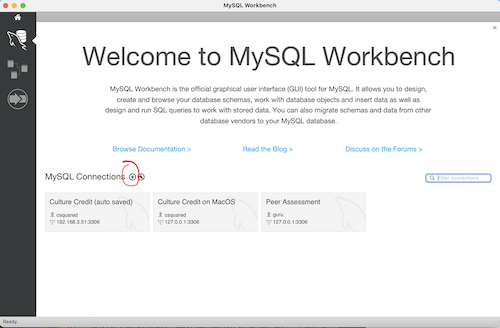
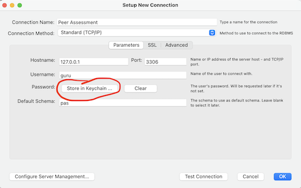

# Peer Assessment System

The Peer Assessment System (PAS) is a MERN full-stack application that allows instructors to deploy peer assessments of team projects.

This system uses MySQL as the relational database.  To create the database, first create a user other than the root in MySQL.  To create a user and give the user the appropriate privileges, enter the following command in the terminal or in PowerShell.

```
mysql -u root -p
``` 
You will need to type in the root password that was created when you installed the database.  You should now see the following prompt,

```
mysql>
```

Type the following commands at the *mysql* prompt and hitting the enter key.

```
mysql> create user guru identified by '<password>';
```

This SQL statement creates a user called **guru** with a password.  Replace <password> with your password.  Make sure you pick something that you remember.  Since this database can only be accessed on localhost, using an easy password is acceptable.

Give user **guru** all privileges on the **pas** database by typing the following and hitting the enter key.

```
mysql> grant all privileges on pas.* to 'guru'@'%';
```

Quit out of mysql by typing the following and hitting the enter key.

```
mysql> \q 
```

Now, you are ready to create the database using the SQL dump file called *pas.dump* provided in this repo.  Type the following on the command line and hitting the enter key.

```
mysql -u guru -p < pas.dump
```

This will drop the **pas** database if it exists and recreate it from scratch with all the table data. So, do not worry about deleting or experimenting with the database.

To look at and query the tables, download MySQL Workbench and create a connection by clicking on the + sign as highlighted in the image below.



This will pop up a connection window.  Complete it as shown in the image below and click on the button hightlighted in the image below to enter the **guru** password.



